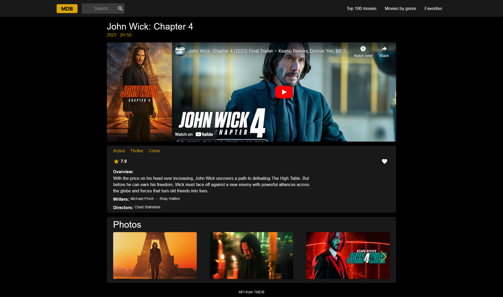

# Moviebase

A site I made to mainly practice React and to work with API's.

## Screenshots




## Built with

- React
- Material UI
- Vite

## Installation

Get your API key from https://www.themoviedb.org/

create a .env in the root directory, VITE_API_KEY=*Your API-KEY*


```bash
git clone https://movie-base-mauve.vercel.app/.git

cd movie-base

npm install
```
    


## Features
- Wishlist
- Search movies
- Sort by genres
- Get top 100 movies
- Details page that fetches trailer from youtube

### Acknowledgements
API: https://www.themoviedb.org/
